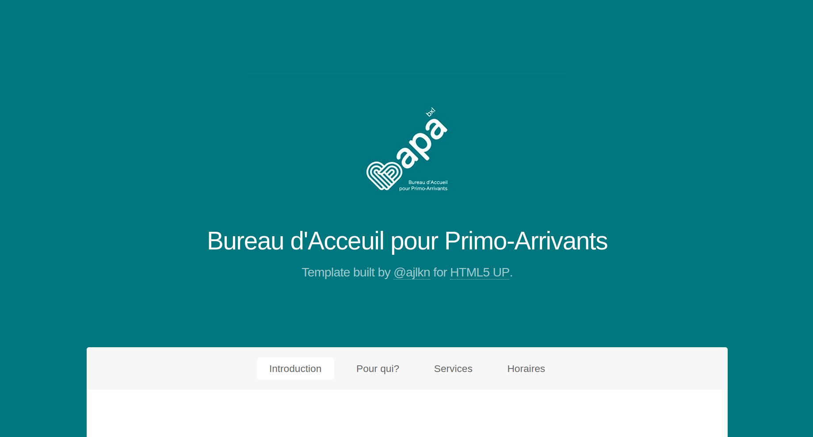
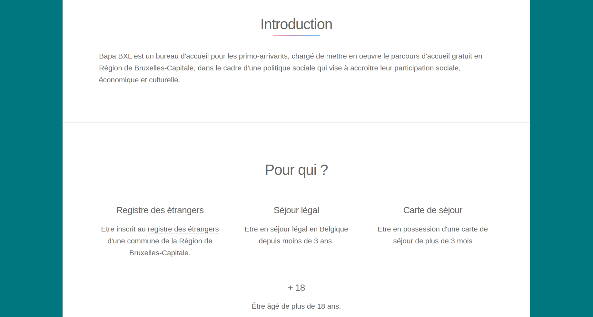
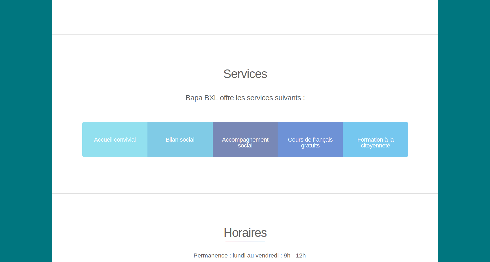
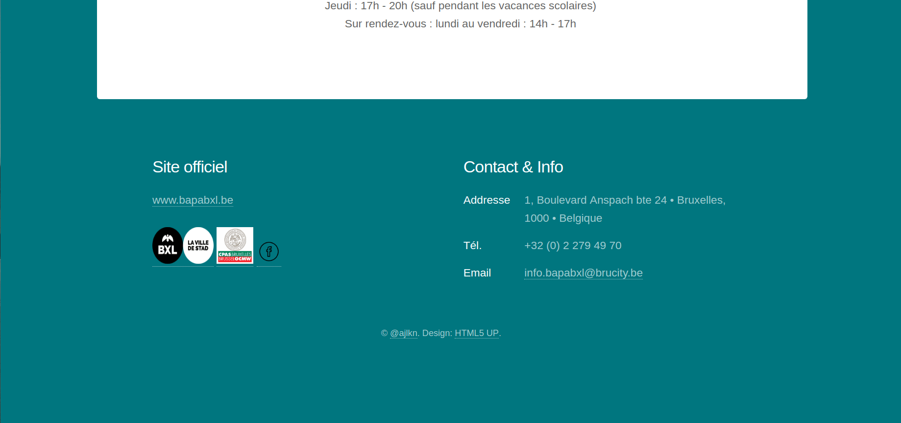
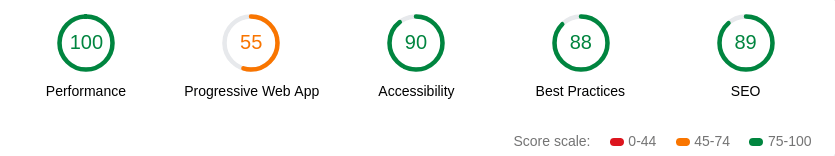

# Fil Rouge 0 Guerrilla

Création d'une **One Page**
sur base d'une proposition de projet par [Julie Connerotte](https://github.com/jujujujul)

Exercice a effectuer pour **BeCode**
[BeCode](https://becode.org/)

## Création

  - Utilisation d'un **template** pour le layout du site sur [html5up](https://html5up.net/)

  - **Template** créé par : [@ajlkn](https://twitter.com/ajlkn)
  
  - Informations récupérées sur le site officiel [BAPA BXL](www.bapabxl.be) et le site de [la ville de Bruxelles](https://www.bruxelles.be/bapa-bxl-laccueil-des-primo-arrivants)

### Lighthouse

Test des performances de la page web

#### Mise en ligne

Mon projet a été déployé en tant que **Page GitHub**

[Fil Rouge 0 Guerilla](https://github.com/Andreapinnapicone/filrouge-0-guerrilla)

#### Auteur

Crée par [Andrea Pinna](https://github.com/Andreapinnapicone) le *01/06/2018* 
Heure de début: **9h30** - Heure de fin: **15h45**